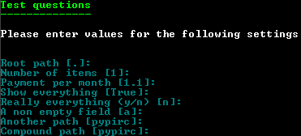

.. Copyright 2013-2014, Simon Kennedy, sffjunkie+code@gmail.com

Ask Me Anything V0.2
====================

Ask Me Anything (AMA) is a package to prompt the user for answers to a series
of questions and return the results as a dictionary.

Questions are specified using a :ref:`JSON dictionary <json_format>`

Currently you have 2 choices in how to ask the questions...

1. Using the terminal

   |terminal_image|

2. Using a Tkinter interface. 

   |tk_image|
   
   The Tk interface has a few niceties; dialogs to select paths, dynamic
   updating of values based on others, a validation indication etc.

.. |tk_image| image:: _static/tk.png

both generated from the same JSON file.

    
License
=======

This module is licensed under the terms of the `Apache`_ V2.0 license.

Contact
=======
    
Simon Kennedy <sffjunkie+code@gmail.com>
    
Version History
===============

======== =======================================================================
Version  Description
======== =======================================================================
0.2      * Added date, time, color handling
         * Changed how questions are defined in JSON
         * Simplification of validation
-------- -----------------------------------------------------------------------
0.1      Initial version with terminal and Tkinter support
======== =======================================================================
    
.. toctree::
   :maxdepth: 2
   :hidden:

   json
   validation   
   module
   module_validator

.. _Apache: http://www.opensource.org/licenses/apache2.0.php
